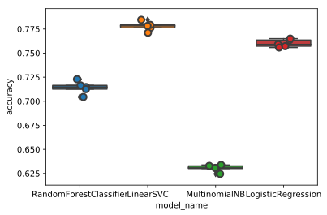

# Multi-Class Text Classification with Scikit-Learn
### Given a list of recipe ingredients, can you predict the cuisine type? --- supervised learning with labeled text data
#### The workflow:
* Data pre-processing (data exploration, train-test split, represent text in numerical values using **tf-idf**)
* Model selection (evaluate models by comparing the cross-validation score of the training set): **logistic regression**, **linear support vector machine**, **multinomial naive bayes**, **random forest**; of which linear SVM performs the best.
* Model evaluation: use the test set to evaluate the best-performing model: linear SVM; visualize the result using a **confusion matrix**

```python
import os
import pandas as pd
import matplotlib.pyplot as plt
import seaborn as sns
from sklearn.model_selection import train_test_split
from sklearn.feature_extraction.text import TfidfVectorizer
from sklearn.feature_extraction.text import CountVectorizer
from sklearn.feature_extraction.text import TfidfTransformer
from sklearn.naive_bayes import MultinomialNB
from sklearn.linear_model import LogisticRegression
from sklearn.ensemble import RandomForestClassifier
from sklearn.model_selection import cross_val_score
from pprint import pprint
from sklearn.model_selection import RandomizedSearchCV
from sklearn.svm import LinearSVC
from sklearn.metrics import confusion_matrix


os.chdir('/Users/chengchen/Desktop/Insight/19C/')
%matplotlib inline
%config InlineBackend.figure_format = 'svg'
```

## Data exploration
#### read and preview data


```python
data_dir = 'Challenge_Recipe2Cuisine/recipies.json'
df = pd.read_json(data_dir)

df.head()
```


<div>
<style scoped>
    .dataframe tbody tr th:only-of-type {
        vertical-align: middle;
    }

    .dataframe tbody tr th {
        vertical-align: top;
    }

    .dataframe thead th {
        text-align: right;
    }
</style>
<table border="1" class="dataframe">
  <thead>
    <tr style="text-align: right;">
      <th></th>
      <th>id</th>
      <th>cuisine</th>
      <th>ingredients</th>
    </tr>
  </thead>
  <tbody>
    <tr>
      <td>0</td>
      <td>10259</td>
      <td>greek</td>
      <td>[romaine lettuce, black olives, grape tomatoes...</td>
    </tr>
    <tr>
      <td>1</td>
      <td>25693</td>
      <td>southern_us</td>
      <td>[plain flour, ground pepper, salt, tomatoes, g...</td>
    </tr>
    <tr>
      <td>2</td>
      <td>20130</td>
      <td>filipino</td>
      <td>[eggs, pepper, salt, mayonaise, cooking oil, g...</td>
    </tr>
    <tr>
      <td>3</td>
      <td>22213</td>
      <td>indian</td>
      <td>[water, vegetable oil, wheat, salt]</td>
    </tr>
    <tr>
      <td>4</td>
      <td>13162</td>
      <td>indian</td>
      <td>[black pepper, shallots, cornflour, cayenne pe...</td>
    </tr>
  </tbody>
</table>
</div>


#### Understanding the number and distribution of cuisine types


```python
df.shape
```


    (39774, 3)


```python
df['ingredients'] = df['ingredients'].apply(', '.join)
df.cuisine.unique()
```


    array(['greek', 'southern_us', 'filipino', 'indian', 'jamaican',
           'spanish', 'italian', 'mexican', 'chinese', 'british', 'thai',
           'vietnamese', 'cajun_creole', 'brazilian', 'french', 'japanese',
           'irish', 'korean', 'moroccan', 'russian'], dtype=object)


```python
ax = sns.countplot(y="cuisine", data=df)
```


* The samples are imbalanced, as shown in the plot above. Conventional algorithms are often biased towards the majority class, not taking the data distribution into consideration. If we care a lot about correctly classifying the minor categories, we could undersample or oversample each class. However, in this specific case, I care about overall precision of predicting cuisine type, and the majority classes might be of our greatest interest. Therefore, I leave the unbalanced data as it is.

#### Indexing cuisine types and creating dictionaries for future use


```python
df['cuisine_id'] = df['cuisine'].factorize()[0]
cuisine_id_df = df[['cuisine', 'cuisine_id']].drop_duplicates().sort_values('cuisine_id')
cuisine_to_id = dict(cuisine_id_df.values)
id_to_cuisine = dict(cuisine_id_df[['cuisine_id', 'cuisine']].values)
df.head()
```


<div>
<style scoped>
    .dataframe tbody tr th:only-of-type {
        vertical-align: middle;
    }

    .dataframe tbody tr th {
        vertical-align: top;
    }

    .dataframe thead th {
        text-align: right;
    }
</style>
<table border="1" class="dataframe">
  <thead>
    <tr style="text-align: right;">
      <th></th>
      <th>id</th>
      <th>cuisine</th>
      <th>ingredients</th>
      <th>cuisine_id</th>
    </tr>
  </thead>
  <tbody>
    <tr>
      <td>0</td>
      <td>10259</td>
      <td>greek</td>
      <td>romaine lettuce, black olives, grape tomatoes,...</td>
      <td>0</td>
    </tr>
    <tr>
      <td>1</td>
      <td>25693</td>
      <td>southern_us</td>
      <td>plain flour, ground pepper, salt, tomatoes, gr...</td>
      <td>1</td>
    </tr>
    <tr>
      <td>2</td>
      <td>20130</td>
      <td>filipino</td>
      <td>eggs, pepper, salt, mayonaise, cooking oil, gr...</td>
      <td>2</td>
    </tr>
    <tr>
      <td>3</td>
      <td>22213</td>
      <td>indian</td>
      <td>water, vegetable oil, wheat, salt</td>
      <td>3</td>
    </tr>
    <tr>
      <td>4</td>
      <td>13162</td>
      <td>indian</td>
      <td>black pepper, shallots, cornflour, cayenne pep...</td>
      <td>3</td>
    </tr>
  </tbody>
</table>
</div>


## Text Representation
* I will use tf-idf to represent the text in vector format, tf-idf is a numerical statistic that is intended to reflect how important a word is to a document in a collection or corpus.
* $\mathrm{tfidf} = \mathrm{tf} \times \mathrm{idf}$, where tf stands for term frequency, and idf stands for inverse document frequency
* $\mathrm{tf}$: In this example of predicting cuisine given ingredients, it makes sense to use a boolean frequency for tf: whether the ingredient list contains a certain ingredient. Formulated as $\mathrm{tf(t,d)} = 1$ if term $t$ occurs in document $d$ and 0 otherwise.
* $\mathrm{idf} = \log \frac{N}{n_t}$, where $N$ is the total number of documents in the corpus, ${n_t}$ is the number of documents where the term $t$ appears (i.e., $\mathrm{tf(t,d)}>0$)


```python
tfidf = TfidfVectorizer(binary = True, sublinear_tf=True, min_df=5, norm='l2', encoding='latin-1', ngram_range=(1, 2), stop_words='english')
features = tfidf.fit_transform(df.ingredients).toarray()
labels = df.cuisine_id
features.shape
```


    (39774, 17805)


* Each of 39774 cuisines are represented by 17805 features,  representing the tf-idf score for different unigrams and bigrams

### Finding the terms that are the most correlated with each of the products
* Chi-square Test for Feature Extraction: 
$$\chi^2 = \frac{\mathrm{(Observed\ frequency\ -\ Expected \ frequency)}^2}{\mathrm{Expected \ frequency}}$$
where **observed frequency** = No. of observations of class, <br>
**Expected frequency** = No. of expected observations of class if there was no relationship between the feature and the target. <br>


```python
from sklearn.feature_selection import chi2
import numpy as np
N = 6
for cuisine, cuisine_id in sorted(cuisine_to_id.items()):
  features_chi2 = chi2(features, labels == cuisine_id)
  indices = np.argsort(features_chi2[1])
  feature_names = np.array(tfidf.get_feature_names())[indices]
  unigrams = [v for v in feature_names if len(v.split(' ')) == 1]
  bigrams = [v for v in feature_names if len(v.split(' ')) == 2]
  print("# '{}':".format(cuisine))
  print("  . Most correlated unigrams:\n. {}".format('\n. '.join(unigrams[:N])))
  print("  . Most correlated bigrams:\n. {}".format('\n. '.join(bigrams[:N])))
```

    # 'brazilian':
      . Most correlated unigrams:
    . cachaca
    . açai
    . manioc
    . granola
    . sweetened
    . tapioca
      . Most correlated bigrams:
    . cachaca lime
    . sugar cachaca
    . lime cachaca
    . chocolate sprinkles
    . ice lime
    . manioc flour
    # 'british':
      . Most correlated unigrams:
    . stilton
    . suet
    . marmite
    . mincemeat
    . jam
    . haddock
      . Most correlated bigrams:
    . beef drippings
    . stilton cheese
    . golden syrup
    . plain flour
    . raspberry jam
    . double cream
    # 'cajun_creole':
      . Most correlated unigrams:
    . cajun
    . creole
    . andouille
    . seasoning
    . celery
    . sausage
      . Most correlated bigrams:
    . cajun seasoning
    . creole seasoning
    . andouille sausage
    . smoked sausage
    . green bell
    . file powder
    # 'chinese':
      . Most correlated unigrams:
    . soy
    . chinese
    . sesame
    . starch
    . shaoxing
    . hoisin
      . Most correlated bigrams:
    . soy sauce
    . sesame oil
    . corn starch
    . hoisin sauce
    . shaoxing wine
    . oyster sauce
    # 'filipino':
      . Most correlated unigrams:
    . calamansi
    . lumpia
    . peppercorn
    . jackfruit
    . belly
    . patis
      . Most correlated bigrams:
    . calamansi juice
    . lumpia wrappers
    . cooking oil
    . sauce bay
    . lumpia skins
    . garlic calamansi
    # 'french':
      . Most correlated unigrams:
    . yolks
    . gruyere
    . tarragon
    . cognac
    . unsalted
    . gruyÚre
      . Most correlated bigrams:
    . egg yolks
    . gruyere cheese
    . large egg
    . unsalted butter
    . grated gruyÚre
    . gruyÚre cheese
    # 'greek':
      . Most correlated unigrams:
    . feta
    . crumbles
    . greek
    . pita
    . dill
    . yogurt
      . Most correlated bigrams:
    . feta cheese
    . cheese crumbles
    . greek seasoning
    . greek yogurt
    . fresh dill
    . pepper feta
    # 'indian':
      . Most correlated unigrams:
    . masala
    . garam
    . turmeric
    . cardamom
    . seed
    . coriander
      . Most correlated bigrams:
    . garam masala
    . ground turmeric
    . cumin seed
    . mustard seeds
    . curry leaves
    . curry powder
    # 'irish':
      . Most correlated unigrams:
    . irish
    . corned
    . guinness
    . brisket
    . potatoes
    . mashed
      . Most correlated bigrams:
    . irish whiskey
    . irish cream
    . cream liqueur
    . corned beef
    . guinness beer
    . irish bacon
    # 'italian':
      . Most correlated unigrams:
    . parmesan
    . mozzarella
    . basil
    . grated
    . italian
    . pasta
      . Most correlated bigrams:
    . parmesan cheese
    . grated parmesan
    . mozzarella cheese
    . fresh basil
    . ricotta cheese
    . olive oil
    # 'jamaican':
      . Most correlated unigrams:
    . jerk
    . allspice
    . jamaican
    . bonnet
    . scotch
    . season
      . Most correlated bigrams:
    . ground allspice
    . jamaican jerk
    . bonnet chile
    . scotch bonnet
    . jerk season
    . jerk seasoning
    # 'japanese':
      . Most correlated unigrams:
    . mirin
    . sake
    . miso
    . dashi
    . nori
    . bonito
      . Most correlated bigrams:
    . bonito flakes
    . white miso
    . sake mirin
    . sushi rice
    . miso paste
    . dried bonito
    # 'korean':
      . Most correlated unigrams:
    . gochujang
    . kimchi
    . base
    . sesame
    . gochugaru
    . korean
      . Most correlated bigrams:
    . gochujang base
    . sesame seeds
    . sesame oil
    . asian pear
    . korean chile
    . toasted sesame
    # 'mexican':
      . Most correlated unigrams:
    . tortillas
    . salsa
    . avocado
    . jack
    . taco
    . jalapeno
      . Most correlated bigrams:
    . corn tortillas
    . flour tortillas
    . black beans
    . jalapeno chilies
    . sour cream
    . taco seasoning
    # 'moroccan':
      . Most correlated unigrams:
    . couscous
    . harissa
    . preserved
    . hanout
    . ras
    . lamb
      . Most correlated bigrams:
    . preserved lemon
    . el hanout
    . ras el
    . couscous ground
    . dried apricot
    . ground ginger
    # 'russian':
      . Most correlated unigrams:
    . beets
    . dill
    . sauerkraut
    . pierogi
    . farmer
    . caviar
      . Most correlated bigrams:
    . potatoes dill
    . farmer cheese
    . buckwheat flour
    . fresh dill
    . beets onions
    . water beets
    # 'southern_us':
      . Most correlated unigrams:
    . buttermilk
    . grits
    . cornmeal
    . pecans
    . baking
    . bourbon
      . Most correlated bigrams:
    . baking powder
    . bourbon whiskey
    . collard greens
    . baking soda
    . chopped pecans
    . self rising
    # 'spanish':
      . Most correlated unigrams:
    . chorizo
    . spanish
    . manchego
    . saffron
    . threads
    . sherry
      . Most correlated bigrams:
    . spanish chorizo
    . manchego cheese
    . sherry vinegar
    . serrano ham
    . chorizo sausage
    . saffron threads
    # 'thai':
      . Most correlated unigrams:
    . thai
    . fish
    . coconut
    . lemongrass
    . kaffir
    . peanuts
      . Most correlated bigrams:
    . fish sauce
    . curry paste
    . red curry
    . coconut milk
    . lime leaves
    . thai red
    # 'vietnamese':
      . Most correlated unigrams:
    . fish
    . vietnamese
    . paper
    . vermicelli
    . nuoc
    . beansprouts
      . Most correlated bigrams:
    . fish sauce
    . rice paper
    . rice vermicelli
    . vietnamese fish
    . rice noodles
    . vietnamese coriander


### Naive bayes classifier --- baseline model


```python
X, y = df.ingredients, df.cuisine
X_train, X_test, y_train, y_test = train_test_split(X, y, test_size = 0.2, random_state = 15)
tfidf = TfidfVectorizer(binary = True, sublinear_tf=True, min_df=5, norm='l2', encoding='latin-1', ngram_range=(1, 2), stop_words='english')
X_train_tfidf = tfidf.fit_transform(X_train)
X_test_tfidf = tfidf.transform(X_test)
clf = MultinomialNB().fit(X_train_tfidf, y_train)
```

* Try some Chinese recipe! (just for fun)


```python
print(clf.predict(tfidf.transform(["oil, tomato, egg, salt, sugar, green onion"])))
```

    ['italian']


```python
print(clf.predict(tfidf.transform(["oil, tomato, egg, salt, sugar, green onion, ginger, garlic"])))
```

    ['chinese']


```python
print(clf.predict(tfidf.transform(["oil, tomato, beef, soy sauce, sugar, water, potato, green onion, ginger, garlic"])))
```

    ['chinese']


* Naive bayes classifier works OK. Errors also make sense. 
<br>

## Model Selection
<br>

* select model from random forest classifier, linear support vector machine, random forest, multinomial naive bayes


```python
X, y = df.ingredients, df.cuisine_id
X_train, X_test, y_train, y_test = train_test_split(X, y, test_size = 0.2, random_state = 15)
tfidf = TfidfVectorizer(binary = True, sublinear_tf=True, min_df=5, norm='l2', encoding='latin-1', ngram_range=(1, 2), stop_words='english')
X_train_tfidf = tfidf.fit_transform(X_train)
X_test_tfidf = tfidf.transform(X_test)

models = [
    RandomForestClassifier(n_estimators=100, max_features=0.5, min_samples_leaf= 2, n_jobs=-1, random_state=0),
    LinearSVC(),
    MultinomialNB(),
    LogisticRegression(random_state=0),
]
CV = 5
cv_df = pd.DataFrame(index = range(CV*len(models)))
entries = []
for model in models:
    model_name = model.__class__.__name__
    accuracies = cross_val_score(model, X_train_tfidf, y_train, scoring = 'accuracy', cv = CV)
    for fold_idx, accuracy in enumerate(accuracies):
        entries.append((model_name, fold_idx, accuracy))
cv_df = pd.DataFrame(entries, columns = ['model_name', 'fold_idx', 'accuracy'])
sns.boxplot(x='model_name', y='accuracy', data=cv_df)
sns.stripplot(x='model_name', y='accuracy', data=cv_df, 
              size=8, jitter=True, edgecolor="gray", linewidth=2)
plt.show()
```

    /Users/chengchen/anaconda/lib/python3.6/site-packages/sklearn/linear_model/logistic.py:432: FutureWarning: Default solver will be changed to 'lbfgs' in 0.22. Specify a solver to silence this warning.
      FutureWarning)
    /Users/chengchen/anaconda/lib/python3.6/site-packages/sklearn/linear_model/logistic.py:469: FutureWarning: Default multi_class will be changed to 'auto' in 0.22. Specify the multi_class option to silence this warning.
      "this warning.", FutureWarning)





```python
cv_df.groupby('model_name').accuracy.mean()
```


    model_name
    LinearSVC                 0.777934
    LogisticRegression        0.760143
    MultinomialNB             0.630444
    RandomForestClassifier    0.714230
    Name: accuracy, dtype: float64


* LinearSVC works the best, therefore use it on the test set <br>


## Model Evaluation
### Accuracy of testing data


```python
model = LinearSVC()
model.fit(X_train_tfidf, y_train)
y_pred = model.predict(X_test_tfidf)

print('accuracy for testing data', sum(y_pred==y_test)/len(y_test))
```

    accuracy for testing data 0.7792583280955374


### Confusion Matrix


```python
conf_mat = confusion_matrix(y_test, y_pred)
fig, ax = plt.subplots(figsize=(10,10))
sns.heatmap(conf_mat, annot=True, fmt='d',
            xticklabels=cuisine_id_df.cuisine.values, yticklabels=cuisine_id_df.cuisine.values)
plt.ylabel('Actual')
plt.xlabel('Predicted')
plt.savefig('Submission_Week 6/confusion_matrix.png')
plt.show()

```


```python

```
